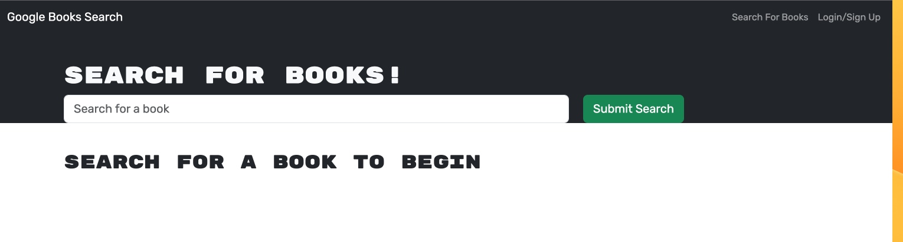
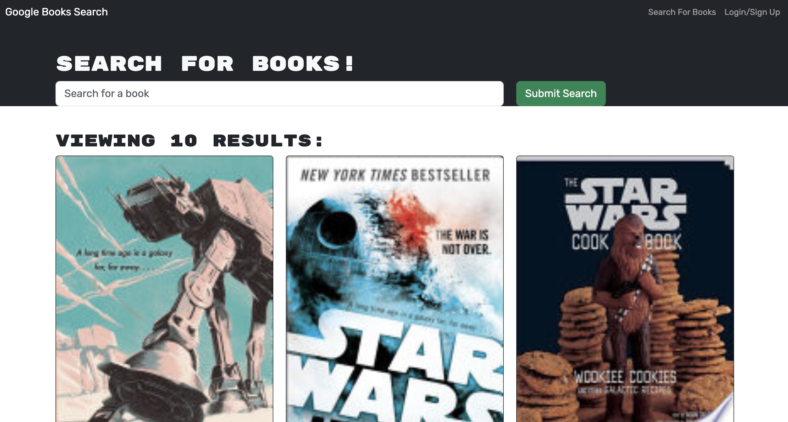

# book-search-engine

## Technology Used 

| Technology Used         | Resource URL           | 
| ------------- |:-------------:| 
| Git | [https://git-scm.com/](https://git-scm.com/)     | 
| Node.js | [https://nodejs.org/api/cli.html](https://nodejs.org/api/cli.html)   |
| NPM | [https://www.npmjs.com/](https://www.npmjs.com/)   |
| GraphQL | [https://www.apollographql.com/](https://www.apollographql.com/)   |

## Description 

 Deployed Site []

This was refactor of this program to convert it to GraphQL from MERN This site allows you search for books while also having the ability to save and delete books by signing in or creating an account.

## Table of Contents 

* [Usage](#usage)
* [Learning Points](#learning-points)
* [Author Info](#author-info)

## Usage 
To use the Book Search Engine, you must first acquire it through GitHub, see above how to do this. After you open it in VS Code, you may then use your computer's terminal or the terminal in VS Code. Make sure you are inside this repository in the terminal, and run `npm run install` and then `npm run develop`. Alternatively just use the Live Site link to access the site from there. You can then create an account, and after that you have the ability to save and and delete books linked to your profile. You can find books by typing in their title in the search bar.

 

## Learning Points 

Through this project, I got more experience working with Apollo and GraphQL.

## Author Info

### Sam Higa 

* [Portfolio](https://samhiga.github.io/my-portfolio/)
* [LinkedIn](https://www.linkedin.com/in/sam-higa-b887b9209/)
* [Github](https://github.com/samhiga)